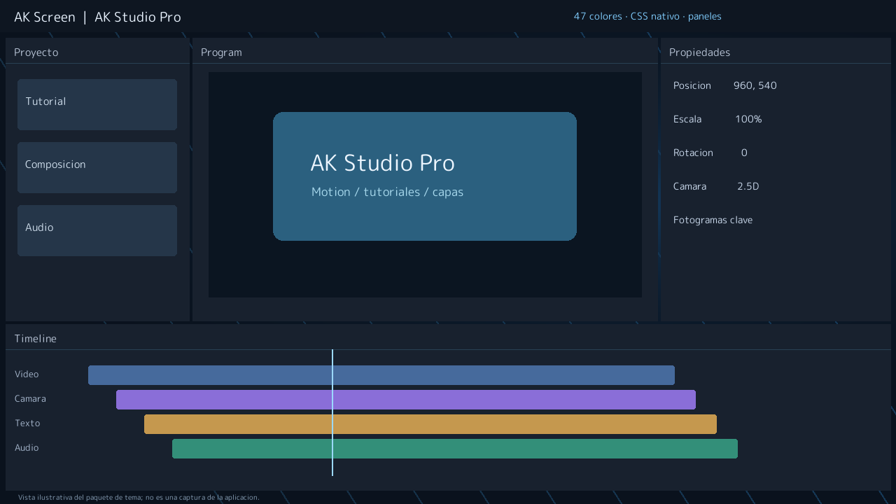

# AK Screen Themes

Temas comunitarios revisados para **AK Screen**. Cada autor conserva sus paquetes, recursos y licencias en su propia carpeta.

[**Explorar el catálogo con vistas previas →**](https://edgajuman.github.io/AK-Screen-Themes/) · [**Abrir el constructor web**](https://edgajuman.github.io/AK-Screen-Themes/theme-studio.html) · [Guía para publicar](CONTRIBUTING.md) · [Descargar AK Screen](https://github.com/Edgajuman/AKScreen-Downloads/releases)

El constructor web permite previsualizar en directo la interfaz de AK Screen 2.3.0, editar los 47 colores nativos, las 11 métricas, la distribución y los tamaños de panel, y añadir hojas CSS nativas, SVG, fuentes y fondos. Exporta un ZIP con la ruta `themes/usuario/id/` listo para revisar y añadir a un pull request. Los datos del borrador se guardan localmente en el navegador; los recursos del tema solo se suben cuando el autor abre un PR.

## AK Studio Pro · ejemplo avanzado

[AK Studio Pro](themes/edgajuman/ak-studio-pro/) requiere AK Screen 2.2.0. Incluye 47 colores, 11 métricas, disposición propia de paneles, hoja CSS nativa, 24 SVG originales, fuente con licencia, fondo WebP y carga GIF animada. La imagen anterior es una captura real de AK Screen 2.2; las imágenes siguientes muestran los temas en 2.1.

## Temas disponibles

| Sakura Pulse | Aurora Glass |
|---|---|
|  |  |
| Índigo, neón sakura, fondos, SVG y fuente M PLUS Rounded 1c. | Una paleta oscura con acento violeta y cursor SVG. |

También incluimos **AK Midnight**, una plantilla nativa con los 38 colores del editor y medidas configurables.

Las vistas previas de Sakura Pulse y Aurora Glass muestran capturas reales de AK Screen 2.1 con contenido de demostración. La pantalla de carga también puede personalizarse:

## Instalar

En AK Screen 2.2: **Configuración → Temas y catálogo → Actualizar → Instalar y aplicar**. En 2.1, abre **Temas → Catálogo**. Puedes ver la imagen de vista previa antes de instalar. La app instala el paquete completo en la carpeta local de temas que tenga configurada cada usuario, conserva sus componentes y verifica tamaño y SHA-256. La ubicación se obtiene de la carpeta Documentos del usuario que ejecuta la app en su propio equipo; nunca se usa la ruta personal del creador. Puedes cambiarla desde Configuración. Los temas instalados funcionan sin conexión.

**En este repositorio de GitHub**, los archivos se organizan en `themes/autor/tema/`. Esa es la estructura que debes usar al crear tu fork o pull request; no debes crear carpetas Documentos dentro del repositorio.

Desde la web: descarga el ZIP, extráelo y selecciona su `theme.json` en **Importar paquete / JSON**. El instalador del tema no ejecuta scripts ni instala fuentes en Windows; las fuentes solo se usan dentro de AK Screen.

## Contribuir

1. Haz un fork de este repositorio.
2. Añade tu tema en `themes/tu-usuario/tu-tema/` usando la [guía y plantilla](CONTRIBUTING.md).
3. Abre un pull request. Las comprobaciones validarán el paquete.
4. **Solo después de que el mantenedor lo acepte en `main`**, GitHub genera el catálogo, el ZIP y la página web. Los forks y PR abiertos no aparecen en el catálogo oficial.

El esquema original con `schema_version: 1` se convierte automáticamente al formato nativo. [Consulta la compatibilidad y todos los campos disponibles](SCHEMA.md).

## Licencias

Cada paquete incluye sus propias atribuciones. Los recursos de Sakura Pulse son originales de Edgajuman / AK Screen; su fuente conserva la licencia SIL OFL 1.1. Los scripts y la página de este repositorio se distribuyen bajo [MIT](LICENSE.txt). Ningún recurso de terceros puede añadirse sin permiso de redistribución.
