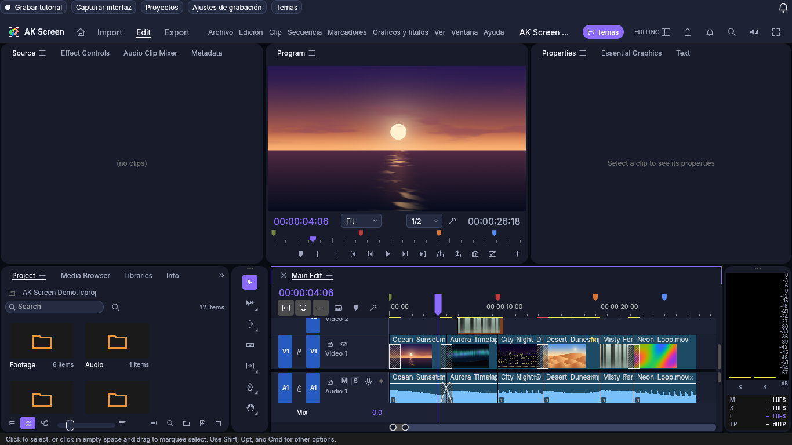

# AK Screen Themes

Temas comunitarios revisados para **AK Screen**. Cada autor conserva sus paquetes, recursos y licencias en su propia carpeta.

[**Explorar el catálogo con vistas previas →**](https://edgajuman.github.io/AK-Screen-Themes/) · [Crear un tema](CONTRIBUTING.md) · [Descargar AK Screen](https://github.com/Edgajuman/AKScreen-Downloads/releases)

## Temas disponibles

| Sakura Pulse | Aurora Glass |
|---|---|
|  |  |
| Índigo, neón sakura, fondos, SVG y fuente M PLUS Rounded 1c. | Una paleta oscura con acento violeta y cursor SVG. |

También incluimos **AK Midnight**, una plantilla nativa con los 38 colores del editor y medidas configurables.

## Instalar

En AK Screen 2.1 o posterior: **Temas → Catálogo → Actualizar → Instalar y aplicar**. Puedes ver la imagen de vista previa antes de instalar. La app instala el paquete completo en la carpeta local de temas que tenga configurada cada usuario, conserva sus componentes y verifica tamaño y SHA-256. La ubicación se obtiene de la carpeta Documentos del usuario que ejecuta la app en su propio equipo; nunca se usa la ruta personal del creador. Puedes cambiarla desde Configuración. Los temas instalados funcionan sin conexión.

**En este repositorio de GitHub**, los archivos se organizan en `themes/autor/tema/`. Esa es la estructura que debes usar al crear tu fork o pull request; no debes crear carpetas Documentos dentro del repositorio.

Desde la web: descarga el ZIP, extráelo y selecciona su `theme.json` en **Importar paquete / JSON**. El instalador del tema no ejecuta scripts ni instala fuentes en Windows; las fuentes solo se usan dentro de AK Screen.

## Contribuir

1. Haz un fork de este repositorio.
2. Añade tu tema en `themes/tu-usuario/tu-tema/` usando la [guía y plantilla](CONTRIBUTING.md).
3. Abre un pull request. Las comprobaciones validarán el paquete.
4. **Solo después de que el mantenedor lo acepte en `main`**, GitHub genera el catálogo, el ZIP y la página web. Los forks y PR abiertos no aparecen en el catálogo oficial.

El esquema original con `schema_version: 1` se convierte automáticamente al formato nativo. [Consulta la compatibilidad y todos los campos disponibles](SCHEMA.md).

## Licencias

Cada paquete incluye sus propias atribuciones. Los recursos de Sakura Pulse son originales de Edgajuman / AK Screen; su fuente conserva la licencia SIL OFL 1.1. Los scripts y la página de este repositorio se distribuyen bajo [MIT](LICENSE.txt). Ningún recurso de terceros puede añadirse sin permiso de redistribución.
